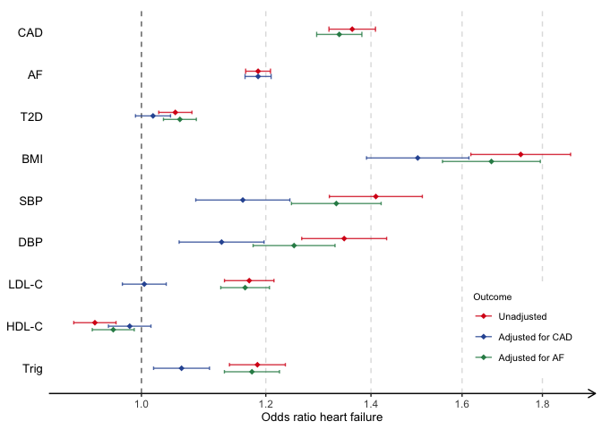

Forest plot example
================

Scripts to recreate [Figure 4 in Shah S & Henry A, *et al.*
(2020)](https://www.nature.com/articles/s41467-019-13690-5/figures/4)

``` r
library(tidyverse)

# Standard deviation info from publication
sd_info <- tibble(Trait = c("SBP", "DBP", "HeartRate"),
                  SD = c(20.7, 11.3, 11.1))

trait_order <- c("CAD", "AF", "T2D",
                 "BMI", "SBP", "DBP", "LDL-C", "HDL-C", "Trig")
bin_traits <-  c("CAD", "AF", "T2D")

data <- read_tsv("data.tsv") %>% 
  rename(b = bxy, Trait = Exposure) %>% 
  mutate(Trait = case_when(Trait == "HDL" ~ "HDL-C",
                           Trait == "LDL" ~ "LDL-C",
                           T ~ Trait))  %>% 
  left_join(sd_info, by="Trait") %>% 
  filter(Trait %in% trait_order,
         (Outcome != "HFcondAF" & Trait != "CAD") |
         (Outcome != "HFcondCAD" & Trait != "AF")) %>% 
  
  mutate(b_sd = ifelse(is.na(SD), b, b*SD),
         se_sd = ifelse(is.na(SD), se, se*SD),
         OR = exp(b_sd),
         LCI = exp(b_sd - qnorm(0.975)*se_sd),
         UCI = exp(b_sd + qnorm(0.975)*se_sd),
         Outcome = factor(Outcome, levels = c("HFcondAF", "HFcondCAD", "HF")),
         Trait = factor(Trait, levels = rev(trait_order))) %>% 
  arrange(match(Trait, trait_order))
```

``` r
pallete <- c("seagreen", "#3057a2", "#d81319")

ggplot(data, aes(y = OR, x = Trait)) + 
  theme_classic() +
  coord_flip(clip = "off") +
  scale_y_continuous(trans = "log", breaks = seq(0.8, 1.8, 0.2)) +
  geom_hline(yintercept = 1, color = "gray34", linetype="dashed", alpha =0.8) +
  geom_point(aes(color = Outcome), shape = "diamond",
             size =2, position = position_dodge(width = 0.25)) +
  geom_errorbar(aes(ymin = LCI, ymax=UCI, color = Outcome),
                alpha=0.8, width=0.25, position =position_dodge(width = 0.25)) +
  scale_color_manual(values = pallete, guide = guide_legend(reverse = T),
                     labels = c("Adjusted for AF", "Adjusted for CAD", "Unadjusted")) +
  labs(y = "Odds ratio heart failure") +
  theme(
    panel.grid.major.x =  element_line(color = "gray88", linetype = "dashed"),
    legend.box.background = element_rect(size = 0),
    legend.justification=c(1,0), legend.position=c(0.97,0.05),
    legend.title = element_text(size = 8),
    legend.text = element_text(size = 8),
    # legend.box.background = element_blank(),
    axis.text.y = element_text(color = "black", size = 10),
    axis.title.x = element_text(color = "black", size = 10),
    axis.line.x = element_line(arrow = arrow(length = unit(0.5, "lines"))),
    axis.title.y = element_blank(),
    axis.line.y = element_blank(),
    axis.ticks.y = element_blank()
  )
```

<!-- -->
